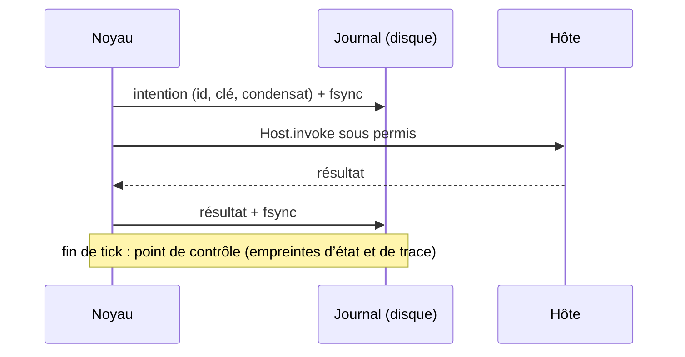

Le [rejeu](/core/record-and-replay) re-dérive une exécution **terminée**. L’exécution durable reprend une exécution **interrompue** : processus tué, machine redémarrée, déploiement en plein run.

## Démarrer et reprendre

```bash
agentl run payments.agent --durable runs/payments
```

La même commande démarre et reprend. C’est le journal du répertoire qui dit si l’exécution est neuve, interrompue ou terminée.

```text
→ exécution durable 6c463a7a4312 : runs/payments/wal.jsonl
```

Après un crash, relancez la même ligne :

```text
↻ reprise de l'exécution durable 6c463a7a4312 : 12 entrée(s) journalisée(s), re-dérivées sans effet
  intention sans résultat : transfer (6c463a7a4312:payments:t1:a1) — sera tranchée
  ↻ transfer (6c463a7a4312:payments:t1:a1) : relancée avec la même clé d'idempotence
```

| Commande | Rôle |
| --- | --- |
| `agentl run X.agent --durable DIR [--run-id ID]` | démarrer, ou reprendre si `DIR` contient un journal |
| `agentl durable status DIR` | état sans reprendre : chaîne, intentions en suspens, résolutions |
| `agentl durable export DIR [-o F]` | journal de rejeu standard d’une exécution terminée, pour `agentl replay` |

`--durable` et `--record` s’excluent : un journal durable s’exporte.

## Le protocole d’une action



À la reprise, le programme est ré-exécuté depuis le tick 0 et chaque franchissement de frontière est servi par le journal : aucun effet, aucun appel au modèle, aucune question. Un point de contrôle qui ne correspond pas à l’état re-dérivé arrête tout. Au-delà du journal, l’exécution continue en direct.

## Une action restée sans résultat

Si le processus meurt entre l’intention et le résultat, l’effet a peut-être eu lieu. La reprise **tranche** :

<Steps>
  <Step title="Outil idempotent : relancé avec la même clé">
    L’outil est déclaré `idempotent=True` : l’hôte promet que son service ignore une seconde requête portant la même clé. L’action s’exécute **exactement une fois**.
  </Step>
  <Step title="Réconciliateur : on demande au monde">
    Un réconciliateur dit si l’action a eu lieu. Si oui, son résultat est journalisé. S’il rend `NOT_EXECUTED`, l’action est exécutée.
  </Step>
  <Step title="Sinon : indéterminée">
    L’action n’est **pas** relancée (au plus une fois). Le runtime ne présume aucun `EFFECT`, marque les `SIDE_EFFECT` déclarés comme sales, et pose `tools.<outil>.in_doubt = true`.
  </Step>
</Steps>

## Côté hôte

```python payments.py
from agentl import Host, Symbol
from agentl.durable import NOT_EXECUTED
from agentl.kernel import current_action


def build():
    host = Host()

    @host.tool("transfer", idempotent=True)
    def transfer(amount, to):
        key = current_action().idempotency_key      # stable d'une reprise à l'autre
        return bank.transfer(amount, to, idempotency_key=key)

    @host.tool("notify")
    def notify(msg):
        mailer.send(msg, message_id=current_action().idempotency_key)
        return {"sent": Symbol("yes")}

    @host.reconciler("notify")
    def notify_done(args, context):
        if mailer.exists(context.idempotency_key):
            return {"sent": Symbol("yes")}
        return NOT_EXECUTED

    return host, None
```

<Warning>
  Un réconciliateur qui ne sait pas doit **lever**, pas rendre `NOT_EXECUTED` : ce serait transformer « peut-être » en « relancer ». Et `idempotent=True` est une promesse de l’hôte que le runtime ne peut pas vérifier.
</Warning>

## Côté programme

Une action indéterminée est un fait, et la politique le lit :

```text
POLICY {
    DEFAULT ALLOW
    NEVER transfer WHEN tools.transfer.in_doubt == true
}
```

`tools.<outil>.in_doubt` vaut `false` au démarrage : la garde n’est pas indéterminée sur une exécution neuve.

## Garanties

| Situation | Garantie |
| --- | --- |
| résultat journalisé | l’action ne se ré-exécute jamais |
| interrompue, outil idempotent ou réconciliable | exactement une fois |
| interrompue, sans promesse de l’hôte | au plus une fois, déclarée indéterminée |
| lecture, question, approbation en vol | refaite (sans effet) |
| `drain` d’événements en vol | événements perdus (au plus une fois) |

## Refus de reprise

| Message | Cause |
| --- | --- |
| `le programme a changé depuis le début de cette exécution` | le `.agent` a été modifié : reprendre ne re-dériverait pas les décisions journalisées |
| `journal durable altéré au franchissement #n` | la chaîne ne se vérifie plus |
| `reprise impossible au franchissement #n` | ce qui est re-dérivé ne correspond pas au journal, par exemple une approbation journalisée pour d’autres arguments |

<Info>
  La chaîne du journal est un SHA-256 **sans clé**. Elle détecte la corruption et la réécriture naïve, pas un faussaire qui peut écrire le répertoire et recalculer toute la chaîne.
</Info>

## API Python

```python
from agentl.durable import DurableRun, FileStore

run = DurableRun(agent, host, llm, store=FileStore("runs/payments"))
runtime = run.run(max_ticks=8)      # neuve, ou reprise
print(run.resumed, run.status, run.journal.resolutions)
```

Stockages : `FileStore` (fichier + fsync), `SQLiteStore(path, run_id)`, `MemoryStore()`. Une société s’exécute sous un seul journal.

<Columns cols={2}>
  <Card title="Noyau et permis" icon="key-round" href="/core/kernel">
    D’où viennent l’identifiant d’action et la clé d’idempotence.
  </Card>
  <Card title="Banc comparatif" icon="scale" href="/core/benchmarks">
    Crash après un virement : AGENT-L, LangGraph, PydanticAI, CrewAI.
  </Card>
</Columns>
