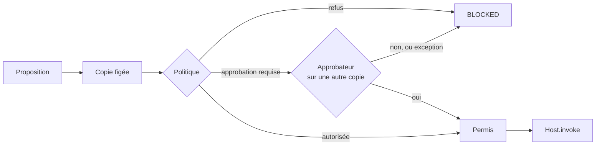

Depuis la v1.9, l’autorisation et l’appel à l’hôte ne vivent plus dans l’interpréteur. Ils vivent dans un **noyau** de quelques fichiers (`agentl/kernel/`). L’interpréteur, le planificateur, le raisonneur bayésien et le Studio **proposent** des actions. Seul le noyau les **autorise**.

## Le passage d’une action



1. La proposition est **figée** : une copie isolée, que ni le planificateur ni l’approbateur ne peuvent modifier.
2. La politique est évaluée sur cette copie. Une exception vaut `DENY`.
3. L’approbateur reçoit une **seconde** copie. Une exception de l’approbateur vaut refus, jamais accord.
4. Le **permis** est émis en dernier. Il est à usage unique et lié au condensat canonique de l’action : outil ou sous-agent, arguments.

`Host.invoke`, `AsyncHost.invoke` et le registre `host.subagents` exigent ce permis. Sans lui, ou avec un permis émis pour d’autres arguments, ils lèvent `PermitError` :

```python
host.invoke("wipe", {"host": "prod-db"})
# PermitError: invoke `wipe` sans permis d'exécution : seul le noyau AGENT-L
#              appelle l'hôte (Kernel.execute)
```

<Note>
  Ce qui a été approuvé est donc exactement ce qui s’exécute. Un défaut du planificateur, du Studio ou d’un hôte peut produire une mauvaise **proposition**. Il ne peut plus produire une exécution que la politique n’a pas autorisée.
</Note>

## Tester un outil

Un test qui appelait `host.invoke` directement lève désormais `PermitError`. Deux façons de faire :

```python
# La logique de l’outil : appeler la fonction enregistrée.
result = host.tools["transfer"](amount=100, to="acct-1")

# Le passage gouverné, avec un vrai noyau :
from agentl.kernel.testing import dispatch
result = dispatch(host, "transfer", {"amount": 100, "to": "acct-1"})
```

## Le contexte de l’action en cours

Dans un outil, `current_action()` rend le contexte de l’action autorisée :

```python
from agentl.kernel import current_action

@host.tool("transfer", idempotent=True)
def transfer(amount, to):
    ctx = current_action()
    # ctx.action_id, ctx.idempotency_key, ctx.attempt
    return bank.transfer(amount, to, idempotency_key=ctx.idempotency_key)
```

La clé d’idempotence est stable d’une reprise à l’autre. C’est elle qui rend l’[exécution durable](/core/durable-execution) « exactement une fois ».

## Les invariants

La suite `tests/test_kernel_invariants_aaa.py` énonce dix invariants, un test par invariant :

| | Invariant |
| --- | --- |
| I1 | aucune action n’atteint l’hôte sans permis émis par le noyau |
| I2 | `NEVER` ne se contourne jamais, ni par approbation, ni par `ALLOW` |
| I3 | une garde indéterminée ne crée jamais une autorisation |
| I4 | une donnée non fiable ne masque pas une donnée fiable |
| I5 | le LLM ne peut désigner qu’un plan déclaré |
| I6 | une action approuvée est exactement celle qui s’exécute |
| I7 | le rejeu ne crée aucune action absente du journal d’origine |
| I8 | la provenance d’une donnée survit à ses transformations |
| I9 | un crash suivi d’une reprise ne double pas un effet |
| I10 | une sortie du modèle n’est jamais une autorité |

I1 est aussi vérifié **sur le code source** : seul le noyau appelle l’hôte. La liste des fichiers de confiance est `agentl.kernel.TCB_FILES`, et un test échoue si elle dépasse son budget.

## Modèle formel

Le protocole du noyau (autorisation, intention, exécution, crash, reprise) est modélisé en TLA+ et vérifié exhaustivement par TLC sur des bornes finies. Cinq mutants plausibles doivent être attrapés, sinon la vérification échoue.

```bash
python3 tools/check_formal.py      # Java 11+ dans le PATH
```

<Warning>
  Le modèle décrit le protocole, pas le code Python. La correspondance est défendue par les tests : crash injecté à chaque écriture du journal, suites aléatoires d’opérations sur les permis. Voir `docs/formal/README.md`.
</Warning>

<Columns cols={2}>
  <Card title="Exécution durable" icon="database-backup" href="/core/durable-execution">
    Reprendre après un crash sans doubler un effet.
  </Card>
  <Card title="Provenance" icon="fingerprint" href="/core/provenance">
    Des gardes qui lisent d’où vient une valeur.
  </Card>
</Columns>
