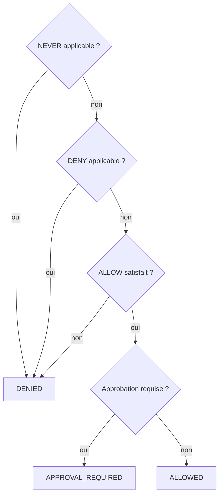

Le moteur de politiques est indépendant du LLM. Aucun chemin d’exécution n’atteint un outil sans le traverser.

## Une politique fermée par défaut

```text
POLICY {
    DEFAULT DENY

    ALLOW inspect_endpoint
    ALLOW isolate_endpoint IF P(credential_attack) >= 0.95

    NEVER isolate_endpoint
        WHEN asset.criticality == CRITICAL

    REQUIRE APPROVAL FOR isolate_endpoint
        WHEN action.risk >= HIGH
}
```

`DEFAULT DENY` signifie qu’ajouter un nouvel outil ne l’autorise pas. Une règle `ALLOW` explicite est nécessaire.

## Ordre de décision



`NEVER` est irrévocable. Une approbation humaine ne le lève pas et une règle `ALLOW` plus spécifique ne gagne pas contre lui.

Depuis la v1.9, cette décision est prise par le [noyau](/core/kernel) : la politique est évaluée sur une copie figée de la proposition, l’approbateur en reçoit une autre, et une exception de la politique ou de l’approbateur vaut refus. L’outil ne s’exécute qu’avec le permis qui en résulte, lié aux arguments exacts.

## Variables de décision

Les gardes peuvent lire l’état et les propriétés de la requête courante :

| Chemin | Valeur |
| --- | --- |
| `action.tool` | nom de l’outil |
| `action.risk` | niveau de risque déclaré |
| `action.origin` | `plan`, `llm` ou `event` |
| `action.confidence` | confiance associée |
| `action.args.*` | arguments proposés |

L’échelle de risque intégrée est ordonnée : `NONE < INFO < LOW < MEDIUM < HIGH < SEVERE < CRITICAL`.

## Gardes indéterminées

Les politiques utilisent une logique trivalente. Un chemin absent n’est pas traité comme un faux rassurant.

| Règle | Garde indéterminée |
| --- | --- |
| `NEVER`, `DENY` | s’applique |
| `ALLOW` | ne satisfait pas |
| `REQUIRE APPROVAL` | route vers l’humain |

Cette convention échoue fermé tout en conservant la logique forte de Kleene pour les expressions composées.

## Gardes de provenance (v1.9)

Une garde peut lire **d’où vient** une valeur, pas seulement ce qu’elle vaut :

```text
POLICY {
    NEVER wipe_host WHEN UNTRUSTED(host) AND NOT ATTESTED(host, check_wipeable)
    NEVER transfer  WHEN LLM_DERIVED(to) AND NOT ATTESTED(to, resolve_account)
    NEVER transfer  WHEN tools.transfer.in_doubt == true
}
```

`UNTRUSTED`, `TRUSTED`, `LLM_DERIVED`, `ATTESTED` et `ORIGIN` sont détaillées dans [Provenance des valeurs](/core/provenance). `tools.<outil>.in_doubt` est posé par l’[exécution durable](/core/durable-execution) quand une reprise n’a pas pu trancher si l’action a eu lieu.

<Warning>
  Un identifiant nu non résolu est une constante symbolique. Préférez un chemin pointé comme `maintenance.window` pour les gardes critiques ; l’analyseur signale les noms simples suspects.
</Warning>

## Écrire des politiques testables

<Steps>
  <Step title="Déclarez le défaut">
    Utilisez `DEFAULT DENY` pour que la surface permise reste explicite.
  </Step>
  <Step title="Autorisez le nominal">
    Ajoutez la condition minimale sous laquelle l’action peut être proposée.
  </Step>
  <Step title="Écrivez les interdits absolus">
    Réservez `NEVER` aux situations qu’aucune approbation ne doit lever.
  </Step>
  <Step title="Déclarez la sortie humaine">
    Utilisez `REQUIRE APPROVAL` pour les risques acceptables mais non autonomes.
  </Step>
  <Step title="Gardez la provenance des cibles">
    Pour toute cible venue du modèle, d’un outil ou d’un message, ajoutez `NEVER outil WHEN UNTRUSTED(cible) AND NOT ATTESTED(cible, validateur)`.
  </Step>
  <Step title="Ajoutez un contre-factuel">
    Créez un `SCENARIO` où l’action serait utile mais doit être bloquée. Écrivez `EXPECT NEVER CALL outil` et `EXPECT BLOCKED outil`.
  </Step>
</Steps>

<Columns cols={2}>
  <Card title="Vérifier les théorèmes" icon="badge-check" href="/core/verifier">
    Examinez routes interdites, replis et surface LLM.
  </Card>
  <Card title="Chaîne de qualité" icon="list-checks" href="/core/quality-gates">
    Intégrez les contrôles dans votre boucle de livraison.
  </Card>
</Columns>
