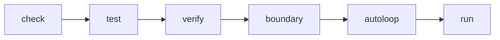

AGENT-L organise la livraison autour de portes distinctes. Chacune répond à une question différente ; aucune ne remplace les autres.



## Les six portes

| Commande | Question | Travaille sur |
| --- | --- | --- |
| `check` | le programme est-il bien formé ? | AST et références |
| `test` | ses critères d’acceptation tiennent-ils ? | `SCENARIO` |
| `verify` | les propriétés de sûreté sont-elles établies ? | AST et espace d’états borné |
| `boundary` | l’hôte cache-t-il des décisions métier ? | AST Python de `X.py` |
| `autoloop` | où l’agent casse-t-il sur des cas dérivés et retenus ? | source et campagnes |
| `run` | que fait-il contre son hôte réel ? | runtime, hôte et LLM |

## Exécution recommandée

```bash
agentl check agent.agent && \
agentl test agent.agent && \
agentl verify agent.agent && \
agentl boundary agent.agent
```

Ne lancez l’exécution réelle qu’après les portes hors ligne :

```bash
agentl run agent.agent --record run.json --html trace.html
```

Pour un agent dont un effet ne doit jamais se produire deux fois (paiement, envoi, suppression), faites aussi le **run de panne durable** : tuez le processus pendant un outil à effet, relancez la même commande, et vérifiez que le monde ne porte l’effet qu’une fois.

```bash
agentl run agent.agent --durable runs/agent      # tuer pendant un outil…
agentl run agent.agent --durable runs/agent      # …puis reprendre
agentl durable status runs/agent                 # relancée, réconciliée ou indéterminée
```

## Bien formé ne veut pas dire sûr

`check` détecte un outil inconnu, un doublon, une référence invalide ou un plan inatteignable. Un programme peut pourtant être parfaitement bien formé et exposer une action dangereuse au LLM, ou n’avoir aucun repli sous un `NEVER`. C’est le rôle de `verify`.

## Tester les règles qui mordent

Un scénario utile force le programme jusqu’au bord de la règle :

```text
SCENARIO critical_asset_is_never_isolated {
    GIVEN {
        asset.criticality = CRITICAL
        threat.status = active
        operator.approval = yes
    }
    EXPECT { threat.status != contained } WITHIN 3
}
```

L’approbation est volontairement présente : le scénario démontre qu’elle ne lève pas le `NEVER`.

## Intégration continue minimale

```bash
python3 -m pytest -q

for source in examples/*.agent; do
  agentl check "$source"
  agentl verify "$source"
  agentl test "$source"
done
```

<Warning>
  Un verdict borné n’est pas une preuve complète. Conservez le libellé produit par le vérificateur au lieu de le reformuler en « démontré ».
</Warning>

<Columns cols={2}>
  <Card title="Lire le rapport verify" icon="badge-check" href="/core/verifier">
    Comprenez les théorèmes, contre-exemples et profondeurs.
  </Card>
  <Card title="Durcir la frontière" icon="scan-line" href="/core/boundary">
    Traitez les décisions cachées dans le Python hôte.
  </Card>
</Columns>
