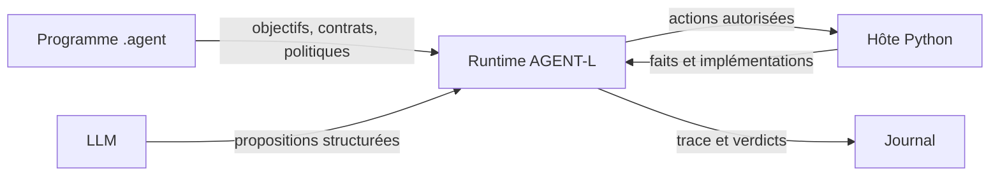
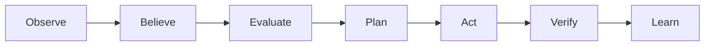

Un système AGENT-L tient sur quatre rôles distincts. Cette séparation est le point de départ de sa vérifiabilité.



## Le programme déclare les décisions

Le fichier `.agent` porte tout ce qui changerait si la politique métier changeait demain :

- objectifs et critères de succès ;
- observations attendues ;
- contrats d’outils, risques et effets ;
- politiques d’autorisation, d’interdiction et d’approbation ;
- plans, règles, hypothèses, scénarios et bornes de boucle.

## L’hôte fournit le monde

Le fichier Python homonyme relie ces contrats au réel : capteurs, appels réseau, écritures, approbateur et sous-agents. Il doit restituer des faits bruts, sans décider à la place du programme.

```python
# Fait brut : correct
host.sensors["service.http_status"] = lambda: probe_http_status()

# Jugement métier caché : à éviter
host.sensors["service.healthy"] = lambda: probe_http_status() == 200
```

Le second exemple soustrait au programme la définition de « sain ». `agentl boundary` existe pour rendre ce glissement visible.

## Le LLM propose dans une surface bornée

Le LLM sert aux blocs `REASON`, à la sélection lorsque le programme l’autorise et à certains flux d’auteur. Ses sorties structurées ne contournent jamais :

1. le contrat d’entrée de l’outil ;
2. le moteur de politiques ;
3. l’approbation éventuelle ;
4. le runtime et sa trace.

<Info>
  Le LLM n’est pas l’autorité de contrôle. Une instruction trouvée dans un journal ou une sortie d’outil ne peut pas réécrire un `NEVER` compilé dans l’AST.
</Info>

## Le runtime arbitre

Un tick suit le cycle suivant :



Le bloc `LOOP` peut ordonner explicitement ces phases. Sa borne `MAX` est finie : un agent AGENT-L termine toujours.

## L’état a plusieurs couches

À l’exécution, un chemin est résolu dans cet ordre : portée locale, croyances, monde observé, puis mémoire. Cela permet à un résultat d’outil ou à une sortie `REASON` d’être utilisé dans le pas courant sans devenir automatiquement une vérité durable.

| Couche | Exemple | Durée |
| --- | --- | --- |
| locale | sortie d’un outil, charge utile d’événement | pas courant |
| croyances | valeur, confiance, source, fraîcheur | révisable |
| monde observé | dernière valeur d’un capteur | jusqu’à la prochaine observation |
| mémoire | court terme, long terme, connaissance | selon le compartiment |

<Card title="Anatomie d’un programme" icon="file-code-2" href="/core/agent-program">
  Parcourez les primitives du langage dans l’ordre où vous les utiliserez.
</Card>
