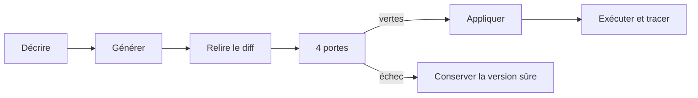

Studio réunit le cycle de vie d’un projet AGENT-L dans une application locale : création assistée, édition du couple normatif, quatre portes de qualité, exécutions en direct, traces, graphes, rejeu et historique.

<Columns cols={2}>
  <Card title="Créer" icon="wand-sparkles">
    Partez d’une mission, de rôles et de skills. Codex CLI ou Claude Code propose l’implémentation.
  </Card>
  <Card title="Gouverner" icon="shield-check">
    Les propositions passent `check`, `test`, `verify` et `boundary` avant application.
  </Card>
  <Card title="Observer" icon="activity">
    Suivez la sortie en direct, filtrez la timeline par agent et ouvrez les artefacts visuels.
  </Card>
  <Card title="Revenir" icon="history">
    Chaque écriture archive la version précédente ; restaurez un fichier depuis l’interface.
  </Card>
</Columns>

## Les espaces de Studio

| Espace | Fonction |
| --- | --- |
| Vue d’ensemble | activité récente et accès rapide aux projets |
| Projets | création, archivage et ouverture des workspaces |
| Skills | bibliothèque système et personnalisée |
| Exécutions | historique global des commandes persistées |
| Paramètres | disponibilité des auteurs, clés runtime et garanties locales |

Dans un projet, les onglets suivent le flux de travail : **Construire**, **Tests**, **Trace**, **Graphe**, **Optimiser**, **Historique** et **Configuration**.

## Un flux gouverné

L’agent auteur ne modifie pas directement votre workspace. Il produit une proposition structurée. Studio la valide dans une copie complète du projet et n’adopte la proposition que lorsque les portes attendues passent.

## Auteur et runtime sont séparés

<Tabs>
  <Tab title="Agent auteur" icon="code-2">
    Codex CLI ou Claude Code écrit les sources et les skills. Il reçoit le contrat de grammaire et les skills sélectionnés, avec des permissions minimales.
  </Tab>
  <Tab title="LLM runtime" icon="cpu">
    Mock, Google Gemini, Anthropic, OpenAI ou une API compatible OpenAI raisonne pendant l’exécution de l’agent. Ce choix est propre au projet.
  </Tab>
</Tabs>

<Warning>
  L’auteur et le runtime sont deux responsabilités différentes. Choisir Codex pour écrire un projet ne signifie pas que l’agent produit utilisera un modèle OpenAI à l’exécution.
</Warning>

## Local par conception

Studio écoute par défaut sur `127.0.0.1`, persiste ses métadonnées en SQLite et écrit les sources dans des workspaces isolés. Les clés fournisseur restent dans les variables d’environnement ; seule leur nom est stocké dans la configuration du projet.

<Columns cols={2}>
  <Card title="Installer Studio" icon="download" href="/studio/installation">
    Préparez le backend, construisez l’interface et démarrez le service.
  </Card>
  <Card title="Créer un projet" icon="folder-plus" href="/studio/first-project">
    Parcourez l’assistant puis lancez la première vérification.
  </Card>
</Columns>
